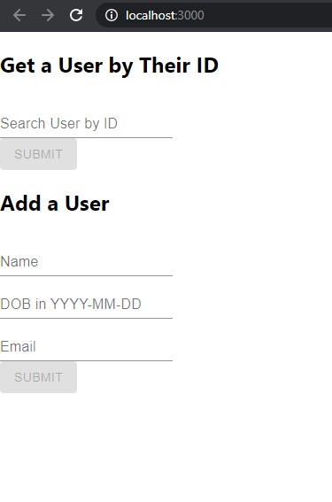
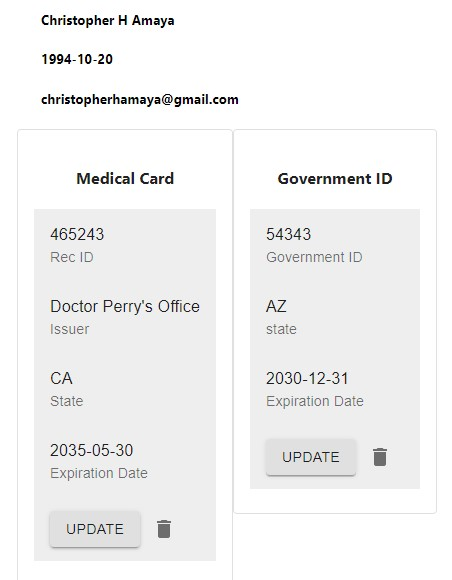
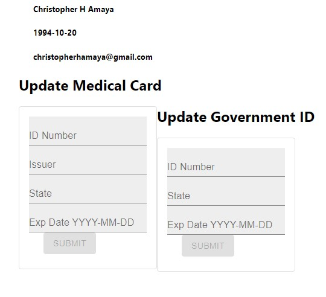

# Updates Made To Project

This project utilizes a front-end and back-end. MySQL is the database that was used to store records. 

The back-end was created with express. It is based on a typical MVC pattern. There are three models used for this project: Medical Card, Government ID, and User. These are the three main components to interact with. To run the back-end, run "npm run server" and it will start at port 5000. A postman collection has been included to run the various API endpoints. Node v13.10.1 is the version this code has been tested on.

The front-end was created with React and Redux. Material-Ui was used to help with CSS and HTML styling. Components are organized into component folders (User, Medical Card,  Government ID). Each component folder organized the components along Redux guidelines. To run the front-end run “npm run start”. With the front-end one can:

* add a new user
* select a user given an ID
* display a Government ID and Medical Card associated with a User
* add the cards if none exist
* update the cards
* delete the cards
* once deleted, the cards can be added again

Run both the client and service in two separate command-lines in order for the project to work ( npm run server and  npm run start for the back-end and front-end respectively). Remember, for the front-end, to 'cd' into the client folder first!

Here are some pictures that show a representation of the front-end application. 

# Card
As a user I would like to be able to use my Medical Recommendation and Government Issued Id for ordering online. I would also like to be able to replace or delete my Medical Recommendation and Id. 

# Conversation
Create a service that stores users, med rec, and id's.

This service should allow a user to upload, update, and delete med rec and id data. 

Store users' name, email, and dob.

Store the med rec number, issuer, state, expiration date, and path to the image.

Store the id number, state, expiration date, and path to the image.

If the med rec or Id is expired, return expired.

# Confirmation
Api endpoint that returns a user, medical recommendation, and id.

If the medical recommendation or id are expired return expired.

Ability to delete or update med rec and id.

Create a dev branch and a pull request to master

# Notes 
Use you normal git workflow except on the initial commit add an estimate of how long it will take to complete the exercise. 

For example git commit -m "Initial commit 3 hours" 

# Bonus
Image uploads

Deploy the application

Create a frontend

